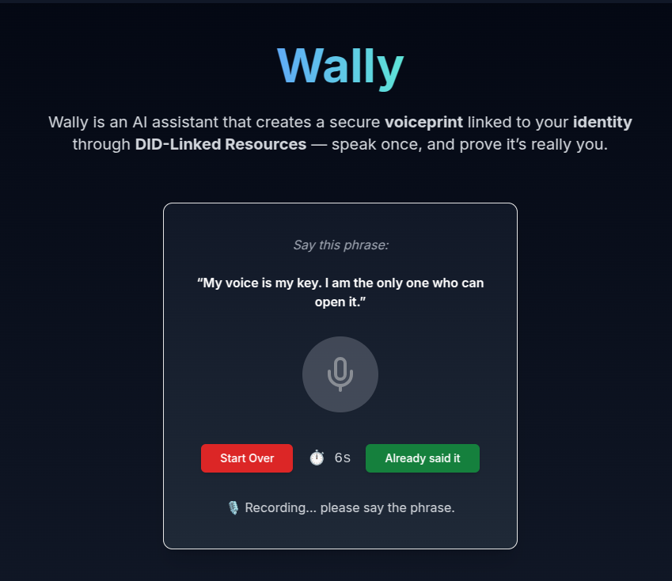

<p align="center">
  
</p>

<h1 align="center">Wally 🤖🗣️</h1>

<p align="center">
    Wally is an AI assistant that creates a secure <strong>voiceprint</strong> linked to your <strong>identity</strong> through <strong>DID-Linked Resources</strong> — speak once, and prove it’s really you.
    <br />
    Powered by
    <a href="https://cheqd.io" target="_blank" rel="noopener noreferrer">cheqd</a> &
    <a href="https://www.verida.ai/" target="_blank" rel="noopener noreferrer">Verida</a>.

</p>

---

## 🚀 How to run locally

There are two ways to run Wally:

---

### ✅ Option 1: Fastest for development (recommended)

Run the backend and frontend separately with full control over the code.

---

#### 1. Setup environment variables

> ⚠️ The file `.env.example` inside the `backend/` folder is a blank template. You must fill it in with your own credentials,
> including Infura project ID, OpenAI API key, cheqd keys, and other required secrets before running the backend.

> The `frontend/.env.example` file is pre-filled and should work out of the box.

---

#### 2. Backend setup (NestJS + Python)

```bash
cd backend
cp .env.example .env
```

##### First-time only (Python setup inside `voice-embedding/`):

```bash
python3 -m venv voice-embedding/.venv
source voice-embedding/.venv/bin/activate
pip install -r voice-embedding/requirements.txt
```

> 🧠 This enables Wally to process voice embeddings using `resemblyzer`, `torch`, etc.

##### Then run the backend:

```bash
yarn install
yarn dev
```

---

#### 3. Frontend setup (Next.js + PNPM)

```bash
cd front-end
cp .env.example .env
pnpm install
pnpm dev
```

> 🎉 Once both servers are running, open [http://localhost:3000](http://localhost:3000) in your browser.  
> You should see Wally welcoming you — congrats, it's live! 🚀

---

### 🐳 Option 2: Run everything with Docker (slower but simpler)

If you prefer to run both frontend and backend together using Docker:

```bash
cp backend/.env.example backend/.env
cp front-end/.env.example front-end/.env
docker-compose up -d
```

> ⚠️ First-time build can take several minutes (especially the Python dependencies for voice processing).  
> Use this only if you **don't plan to touch the code** or want to test it quickly.

Frontend will be at [http://localhost:3000](http://localhost:3000)  
Backend at [http://localhost:5000](http://localhost:5000)

---

## ⚙️ About the stack

Yes, we're using **different package managers**:
- `yarn` for backend
- `pnpm` for frontend

We're open to suggestions — there's an ongoing holy war (`npm` vs `pnpm` vs `yarn`) 😅

---

## 🧠 Voice AI Features

- Record your voice and generate a unique **voiceprint** embedding.
- Link that embedding to a DID via **DID-Linked Resources** (powered by Cheqd).
- Verify your identity later by comparing live input against your stored voiceprint.


## 📁 Folder Structure

- `/frontend` — Voice interface & credential flow using Cheqd and Verida 
- `/backend` — Voiceprint embedding, credential issuing, identity verification APIs
- `/backend/voice-embedding` — Python-based voice embedding logic using Resemblyzer

---

## 🤝 Credits

Built with ❤️ for the Verifiable AI Hackathon.
Special thanks to the teams behind <a href="https://www.cheqd.io/" target="_blank">Cheqd</a> and <a href="https://www.verida.ai/" target="_blank">Verida</a> for their incredible support and tooling.
